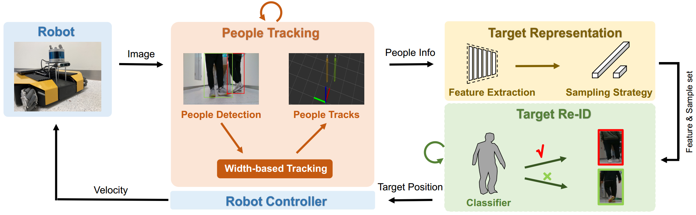

# MPF_GRR_SLT



## Dependencies
- Ubuntu 18.04
- Melodic
1. Create a conda environment and install pytorch
```bash
conda create -n mono_following python=3.8
conda activate mono_following
conda install pytorch torchvision -c pytorch
```
2. Install python related packages:
```bash
pip install -r requirements.txt
pip install pycocotools
git clone https://github.com/eric-wieser/ros_numpy
cd ros_numpy
python setup.py install
```
3. Install cpp related packages:
- OpenCV==3.4
- Eigen==3.0+

## Download pre-trained weights

- Download [yolox-s](https://megvii-my.sharepoint.cn/:u:/g/personal/gezheng_megvii_com/EW62gmO2vnNNs5npxjzunVwB9p307qqygaCkXdTO88BLUg?e=NMTQYw) and [yolox-m](https://megvii-my.sharepoint.cn/:u:/g/personal/gezheng_megvii_com/ERMTP7VFqrVBrXKMU7Vl4TcBQs0SUeCT7kvc-JdIbej4tQ?e=1MDo9y), then put them to `mono_tracking/scripts/yolox_descriptor/weights`

## Our tf tree
```bash
base_link->camera_link->camera_optical_link
```

## How to use

### Tracking

```bash
# launch width-based monocular people tracking
# If running with rosbag, use_sim_time:=true; if the image topic is compressed, sim:=true
roslaunch mono_tracking all_mono_tracking.launch sim:=true use_sim_time:=true
# If running in real robot, use_sim_time:=false;
roslaunch mono_tracking all_mono_tracking.launch sim:=true use_sim_time:=false
```
- Input: /camera/color/image_raw
- Output: mono_tracking/msg/TrackArray.msg

### Target Identification

```bash
# launch our GRR_SLT_MPF person following, use_sim_time:=true for rosbag
roslaunch mono_followng mono_following.launch use_sim_time:=true
# launch our GRR_SLT_MPF person following, use_sim_time:=false for robot running
roslaunch mono_followng mono_following.launch use_sim_time:=false
```
- Input: mono_tracking/msg/TrackArray.msg
- Output: mono_following/msg/Target.msg


### Controlling and Following

```bash
# launch control
roslaunch mono_control mono_controlling.launch
```
- Input: mono_following/msg/Target.msg; /bluetooth_teleop/joy
- Output: /cmd_vel

## Custom built Dataset


- TODO

## Citation
- "Following Closely: A Robust Monocular Person Following System for Mobile Robot"
- The paper is under review

## Acknowledge
- [YOLOX_deepsort_tracker](https://github.com/pmj110119/YOLOX_deepsort_tracker)
- [monocular_person_following](https://github.com/koide3/monocular_person_following)

