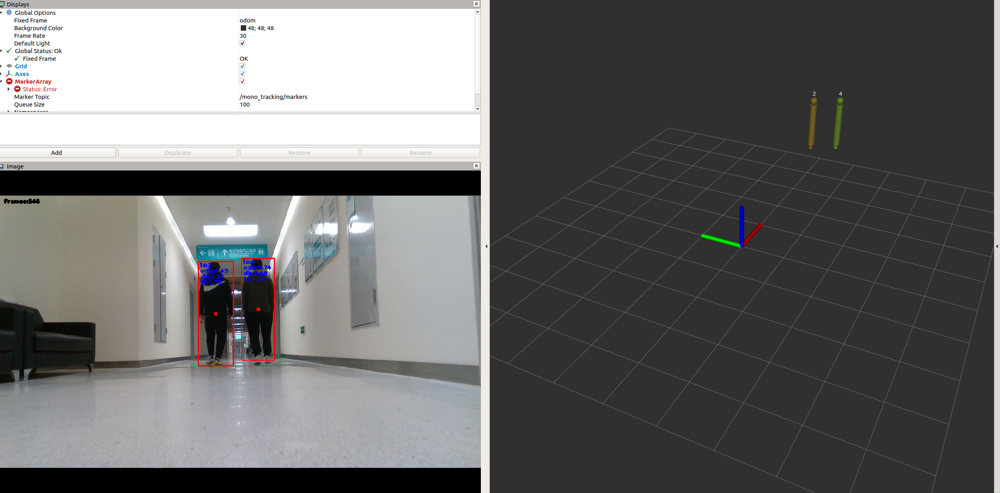

# Width-based Monocular People Tracking


## Introduction


It achieves people tracking by a known target width and a Kalman filter with a monocular camera.

## How to use


```bash
roslaunch mono_tracking all_mono_tracking.launch sim:=true
```
- *sim*: If the frames are compressed, set to `true`. Otherwise, set to `false`.
